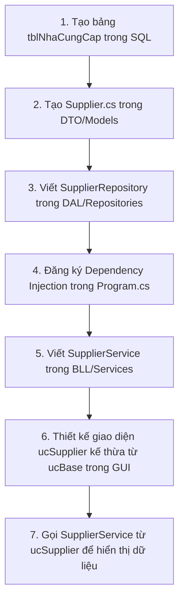

# 🏢 Hệ Thống Quản Lý Cửa Hàng Bán Lẻ - Kiến Trúc 4 Lớp (N-Tier) Chuẩn

Dự án này được xây dựng theo mô hình **N-Tier (4 Lớp)** chuyên nghiệp sử dụng .NET 8 và Windows Forms, đảm bảo tính bảo mật cao, phân chia trách nhiệm rõ ràng, giao diện đồng nhất và khả năng làm việc nhóm song song hiệu quả.

---

## 📂 1. Cấu trúc Thư mục Chi tiết & Phân tích 4 Tầng

Hệ thống được tổ chức chặt chẽ theo nguyên tắc **Module hóa (Feature-based)** ở các tầng chức năng. Dưới đây là chi tiết tất cả các tệp tin hiện có trong dự án:

### 📦 1.1. Tầng DTO (Data Transfer Objects / Models)
*Nằm tại thư mục `AssignmentApp/DTO/Models/`. Định nghĩa các cấu trúc dữ liệu thuần túy (POCO) để truyền tải thông tin giữa các tầng mà không chứa logic xử lý.*

*   **[Category.cs](file:///d:/0Project/Chmanet/.NET-nhom13/AssignmentApp/DTO/Models/Category.cs)**: Đại diện cho thực thể Danh mục sản phẩm (`MaDanhMuc`, `TenDanhMuc`, `MoTa`, `NgayTao`).
*   **[Customer.cs](file:///d:/0Project/Chmanet/.NET-nhom13/AssignmentApp/DTO/Models/Customer.cs)**: Đại diện cho thực thể Khách hàng (`MaKhachHang`, `TenKhachHang`, `SoDienThoai`, `DiemTichLuy`, `NgayTao`).
*   **[MenuPermissions.cs](file:///d:/0Project/Chmanet/.NET-nhom13/AssignmentApp/DTO/Models/MenuPermissions.cs)**: Đối tượng lưu trữ trạng thái phân quyền hiển thị menu sidebar cho từng vai trò (`ShowAdmin`, `ShowSales`, `ShowWarehouse`).
*   **[Order.cs](file:///d:/0Project/Chmanet/.NET-nhom13/AssignmentApp/DTO/Models/Order.cs)**: Đại diện cho thực thể Đơn hàng / Hóa đơn bán lẻ.
*   **[Product.cs](file:///d:/0Project/Chmanet/.NET-nhom13/AssignmentApp/DTO/Models/Product.cs)**: Đại diện cho thực thể Sản phẩm / Hàng hóa (`MaHang`, `TenHang`, `MaLoai`, `SoLuong`, `DonGiaNhap`, `DonGiaBan`, `GhiChu`).
*   **[Promotion.cs](file:///d:/0Project/Chmanet/.NET-nhom13/AssignmentApp/DTO/Models/Promotion.cs)**: Đại diện cho thực thể Chương trình khuyến mãi.
*   **[User.cs](file:///d:/0Project/Chmanet/.NET-nhom13/AssignmentApp/DTO/Models/User.cs)**: Đại diện cho thực thể Người dùng hệ thống / Nhân viên (`MaNguoiDung`, `TenNguoiDung`, `SoDienThoai`, `Email`, `MatKhau`, `VaiTro`, `TrangThai`, `NgayTao`).

---

### 📦 1.2. Tầng DAL (Data Access Layer - Tầng Truy xuất Dữ liệu)
*Nằm tại thư mục `AssignmentApp/DAL/`. Thực hiện các truy vấn trực tiếp xuống Database thông qua Dapper (Micro-ORM).*

*   **Tầng lõi kết nối (Core)**:
    *   **[DbContext.cs](file:///d:/0Project/Chmanet/.NET-nhom13/AssignmentApp/DAL/Core/DbContext.cs)**: Quản lý vòng đời kết nối `SqlConnection` (từ thư viện `Microsoft.Data.SqlClient`), cấu hình Connection String và cung cấp các hàm bổ trợ thực thi ADO.NET truyền thống (`GetDataToTable`, `RunSql`, `CheckKey`, `GetFieldValues`).
*   **Kho chứa truy vấn (Repositories)**:
    *   **Main**:
        *   **[IAuthRepository.cs](file:///d:/0Project/Chmanet/.NET-nhom13/AssignmentApp/DAL/Repositories/Main/IAuthRepository.cs)** & **[AuthRepository.cs](file:///d:/0Project/Chmanet/.NET-nhom13/AssignmentApp/DAL/Repositories/Main/AuthRepository.cs)**: Lấy thông tin tài khoản người dùng theo `MaNguoiDung` phục vụ nghiệp vụ đăng nhập.
        *   **[IMainRepository.cs](file:///d:/0Project/Chmanet/.NET-nhom13/AssignmentApp/DAL/Repositories/Main/IMainRepository.cs)** & **[MainRepository.cs](file:///d:/0Project/Chmanet/.NET-nhom13/AssignmentApp/DAL/Repositories/Main/MainRepository.cs)**: Xử lý các truy vấn cấu hình chung cho ứng dụng chính.
    *   **Admin**:
        *   **[UserRepository.cs](file:///d:/0Project/Chmanet/.NET-nhom13/AssignmentApp/DAL/Repositories/Admin/UserRepository.cs)**: Thực hiện các truy vấn CRUD liên quan đến tài khoản nhân viên (đang dùng bảng tham chiếu mẫu `tblNhanvien`).
        *   **[PromotionRepository.cs](file:///d:/0Project/Chmanet/.NET-nhom13/AssignmentApp/DAL/Repositories/Admin/PromotionRepository.cs)**: Truy vấn dữ liệu chương trình khuyến mãi.
        *   **[ReportRepository.cs](file:///d:/0Project/Chmanet/.NET-nhom13/AssignmentApp/DAL/Repositories/Admin/ReportRepository.cs)**: Thống kê doanh thu, báo cáo từ SQL Server.
    *   **Sales**:
        *   **[CustomerRepository.cs](file:///d:/0Project/Chmanet/.NET-nhom13/AssignmentApp/DAL/Repositories/Sales/CustomerRepository.cs)**: Xử lý thông tin khách hàng thân thiết.
        *   **[DeliveryRepository.cs](file:///d:/0Project/Chmanet/.NET-nhom13/AssignmentApp/DAL/Repositories/Sales/DeliveryRepository.cs)**: Theo dõi trạng thái vận chuyển đơn hàng.
        *   **[OrderRepository.cs](file:///d:/0Project/Chmanet/.NET-nhom13/AssignmentApp/DAL/Repositories/Sales/OrderRepository.cs)**: Lưu thông tin hóa đơn và chi tiết hóa đơn.
        *   **[POSRepository.cs](file:///d:/0Project/Chmanet/.NET-nhom13/AssignmentApp/DAL/Repositories/Sales/POSRepository.cs)**: Xử lý nghiệp vụ bán hàng tại quầy.
        *   **[ReturnRepository.cs](file:///d:/0Project/Chmanet/.NET-nhom13/AssignmentApp/DAL/Repositories/Sales/ReturnRepository.cs)**: Thực hiện nghiệp vụ hoàn/trả hàng lỗi.
    *   **Warehouse**:
        *   **[ProductRepository.cs](file:///d:/0Project/Chmanet/.NET-nhom13/AssignmentApp/DAL/Repositories/Warehouse/ProductRepository.cs)**: Chứa các lệnh CRUD sản phẩm dùng Dapper để chống SQL Injection (đang truy vấn bảng tham chiếu mẫu `tblHangHoa`).
        *   **[CategoryRepository.cs](file:///d:/0Project/Chmanet/.NET-nhom13/AssignmentApp/DAL/Repositories/Warehouse/CategoryRepository.cs)**: Quản lý danh mục hàng hóa trong kho.
        *   **[InventoryRepository.cs](file:///d:/0Project/Chmanet/.NET-nhom13/AssignmentApp/DAL/Repositories/Warehouse/InventoryRepository.cs)**: Thống kê lượng tồn kho thực tế và lịch sử biến động.
        *   **[StockInRepository.cs](file:///d:/0Project/Chmanet/.NET-nhom13/AssignmentApp/DAL/Repositories/Warehouse/StockInRepository.cs)**: Ghi nhận và quản lý các phiếu nhập hàng.
*   **Kịch bản cơ sở dữ liệu (Scripts)**:
    *   **[Database.sql](file:///d:/0Project/Chmanet/.NET-nhom13/AssignmentApp/DAL/Scripts/Database.sql)**: File script SQL hoàn chỉnh thiết lập database `CKNet` gồm 15 bảng liên kết khóa ngoại chặt chẽ và nạp sẵn 15 dòng dữ liệu mẫu cho mỗi bảng để kiểm thử.

> [!NOTE]  
> **Lưu ý về các bảng mẫu**: Tệp `ProductRepository.cs` và `UserRepository.cs` được viết dựa trên bảng mẫu cũ (`tblHangHoa`, `tblNhanvien`) phục vụ mục đích minh họa và học tập cấu trúc. Khi xây dựng các chức năng thực tế, các thành viên nên viết truy vấn khớp với schema chính thức trong `Database.sql` (bảng `SanPham`, `NguoiDung`, v.v.).

---

### 📦 1.3. Tầng BLL (Business Logic Layer - Tầng Nghiệp Vụ)
*Nằm tại thư mục `AssignmentApp/BLL/`. Chịu trách nhiệm kiểm tra tính hợp lệ của dữ liệu (validation), xử lý tính toán logic trước khi gọi xuống DAL hoặc trả kết quả lên GUI.*

*   **Dịch vụ nghiệp vụ (Services)**:
    *   **Main**:
        *   **[IAuthService.cs](file:///d:/0Project/Chmanet/.NET-nhom13/AssignmentApp/BLL/Services/Main/IAuthService.cs)** & **[AuthService.cs](file:///d:/0Project/Chmanet/.NET-nhom13/AssignmentApp/BLL/Services/Main/AuthService.cs)**: Chứa nghiệp vụ xác thực tài khoản. Sử dụng `PasswordHasher` để so sánh mã băm BCrypt mật khẩu người dùng nhập vào.
        *   **[IMainService.cs](file:///d:/0Project/Chmanet/.NET-nhom13/AssignmentApp/BLL/Services/Main/IMainService.cs)** & **[MainService.cs](file:///d:/0Project/Chmanet/.NET-nhom13/AssignmentApp/BLL/Services/Main/MainService.cs)**: Thực hiện xử lý nghiệp vụ đăng xuất (xóa phiên) và phân quyền ứng dụng dựa trên vai trò của tài khoản.
    *   **Admin**: `EmployeeService.cs`, `PromotionService.cs`, `ReportService.cs`.
    *   **Sales**: `CustomerService.cs`, `DeliveryService.cs`, `OrderService.cs`, `POSService.cs`, `ReturnService.cs`.
    *   **Warehouse**: `CategoryService.cs`, `InventoryService.cs`, `ProductService.cs`, `StockInService.cs`.
*   **Quản lý phiên đăng nhập (Session)**:
    *   **[UserSession.cs](file:///d:/0Project/Chmanet/.NET-nhom13/AssignmentApp/BLL/Session/UserSession.cs)**: Lớp static lưu giữ thông tin người dùng đang đăng nhập (`CurrentUser`) và thời gian đăng nhập (`LoginTime`) toàn cục.
*   **Tiện ích kiểm tra & bảo mật (Utils)**:
    *   **[PasswordHasher.cs](file:///d:/0Project/Chmanet/.NET-nhom13/AssignmentApp/BLL/Utils/PasswordHasher.cs)**: Thực hiện băm và kiểm tra mật khẩu an toàn bằng thuật toán **BCrypt.Net**.
    *   **[Validator.cs](file:///d:/0Project/Chmanet/.NET-nhom13/AssignmentApp/BLL/Utils/Validator.cs)**: Hỗ trợ xác thực các định dạng dữ liệu đầu vào (Email, số điện thoại, chuỗi trống).

---

### 📦 1.4. Tầng GUI (Presentation Layer - Giao Diện Người Dùng)
*Nằm tại thư mục `AssignmentApp/GUI/`. Hiển thị thông tin lên màn hình và nhận tương tác từ người dùng thông qua các Guna2 WinForms controls.*

*   **Thiết kế Giao diện Gốc (Base)**:
    *   **[frmBase.cs](file:///d:/0Project/Chmanet/.NET-nhom13/AssignmentApp/GUI/Base/frmBase.cs)**: Form nền tảng được thiết lập sẵn kích thước chuẩn (1000x700) và màu nền hiện đại (`#F0F2F5`). Mọi Form trong dự án đều kế thừa từ Form này.
    *   **[ucBase.cs](file:///d:/0Project/Chmanet/.NET-nhom13/AssignmentApp/GUI/Base/ucBase.cs)**: User Control nền tảng dùng chung cho tất cả các tab chức năng.
*   **Màn hình chính (Forms)**:
    *   **[AuthForm.cs](file:///d:/0Project/Chmanet/.NET-nhom13/AssignmentApp/GUI/Forms/AuthForm.cs)**: Màn hình đăng nhập bảo mật. Tích hợp khả năng tự kiểm tra trạng thái kết nối SQL Server và hỗ trợ điều hướng nhanh bằng phím mũi tên Lên/Xuống.
    *   **[frmMain.cs](file:///d:/0Project/Chmanet/.NET-nhom13/AssignmentApp/GUI/Forms/frmMain.cs)**: Màn hình làm việc chính chứa bố cục Sidebar. Sidebar tự động ẩn/hiển thị các nút chức năng phụ thuộc vào quyền hạn trả về từ `MainService`.
*   **Các Tab chức năng (UserControls)**:
    *   **Admin**:
        *   `ucPromotion.cs`: Quản lý các chương trình ưu đãi, giảm giá.
        *   `ucReports.cs`: Hiển thị biểu đồ thống kê doanh thu bán hàng trực quan.
        *   `ucUserManagement.cs`: Quản lý danh sách nhân viên và cấp tài khoản.
    *   **Sales**:
        *   `ucPOS.cs`: Giao diện lập đơn và thanh toán nhanh cho khách tại quầy.
        *   `ucOrderManagement.cs`: Danh sách và trạng thái các hóa đơn đã bán.
        *   `ucCustomer.cs`: Quản lý thông tin và điểm tích lũy của khách hàng.
        *   `ucDelivery.cs`: Quản lý thông tin các đơn hàng cần giao đi.
        *   `ucReturns.cs`: Giao diện xử lý yêu cầu trả hàng/hoàn tiền.
    *   **Warehouse**:
        *   `ucProductList.cs`: Quản lý thông tin sản phẩm và giá cả.
        *   `ucCategory.cs`: Quản lý phân loại sản phẩm.
        *   `ucStockIn.cs`: Lập phiếu nhập kho khi nhập hàng mới từ nhà cung cấp.
        *   `ucInventory.cs`: Xem lượng hàng tồn thực tế trong kho.
*   **Hộp thoại thông báo (Utils)**:
    *   **[MsgBox.cs](file:///d:/0Project/Chmanet/.NET-nhom13/AssignmentApp/GUI/Utils/MsgBox.cs)**: Hàm tiện ích hiển thị hộp thoại `Guna2MessageDialog` đồng bộ giao diện thay thế cho `MessageBox.Show` truyền thống.

---

## 🛠️ 2. Quy trình làm việc (Workflow) để thêm một chức năng mới

Để hoàn thiện một chức năng mới (Ví dụ: chức năng "Quản lý Nhà cung cấp"):



1.  **Thiết kế Database**: Viết câu lệnh tạo bảng trong file [Database.sql](file:///d:/0Project/Chmanet/.NET-nhom13/AssignmentApp/DAL/Scripts/Database.sql) và chạy trên SQL Server.
2.  **Tạo DTO**: Tạo file `Supplier.cs` trong `DTO/Models` định nghĩa cấu trúc dữ liệu.
3.  **Xây dựng DAL**: Tạo lớp `SupplierRepository.cs` trong `DAL/Repositories/Warehouse/`. Viết các câu lệnh truy vấn bằng Dapper (sử dụng Parameterized Query để tránh SQL Injection).
4.  **Đăng ký DI**: Mở tệp [Program.cs](file:///d:/0Project/Chmanet/.NET-nhom13/AssignmentApp/Program.cs) để đăng ký dịch vụ:
    ```csharp
    services.AddTransient<ISupplierRepository, SupplierRepository>();
    services.AddTransient<ISupplierService, SupplierService>();
    ```
5.  **Xây dựng BLL**: Tạo lớp `SupplierService.cs` trong `BLL/Services/Warehouse/` để xử lý logic kiểm tra đầu vào trước khi lưu trữ.
6.  **Thiết kế GUI**: Tạo User Control `ucSupplier.cs` kế thừa từ `Base.ucBase` trong thư mục `GUI/UserControls/Warehouse/`. Sử dụng các linh kiện Guna2 UI để thiết kế giao diện kéo thả trực quan.
7.  **Ráp nối**: Gọi các hàm từ `SupplierService` để load dữ liệu lên DataGridView và thực hiện các chức năng Thêm, Sửa, Xóa.

---

## 🏆 3. Các Tiêu chí Đạt điểm cao & Dấu hiệu nhận biết trong Code

| Tiêu chí | Giải thích khái niệm | Dấu hiệu nhận biết trong bài |
| :--- | :--- | :--- |
| **Kiến trúc 4 lớp chuẩn** | Chia tách rõ ràng giữa GUI (Màn hình), BLL (Nghiệp vụ), DAL (Cơ sở dữ liệu) và DTO (Đối tượng dữ liệu). | Tổ chức thư mục rõ ràng theo đúng tên gọi: **GUI, BLL, DAL, DTO**. |
| **Dependency Injection** | Đăng ký và tiêm (inject) các dịch vụ tự động, giúp mã nguồn lỏng lẻo (loose coupling) và dễ viết Unit Test. | Khai báo và cấu hình dịch vụ thông qua `ServiceCollection` và `ServiceProvider` tại [Program.cs](file:///d:/0Project/Chmanet/.NET-nhom13/AssignmentApp/Program.cs). |
| **Repository Pattern** | Đóng gói logic truy xuất dữ liệu, giúp tầng nghiệp vụ không phụ thuộc vào công nghệ lưu trữ. | Các file kết thúc bằng hậu tố **`Repository.cs`** nằm trong thư mục `DAL/Repositories/`. |
| **Dapper (Micro-ORM)** | Thư viện kết nối DB tốc độ cao, giảm thiểu viết code ADO.NET dài dòng mà vẫn giữ được hiệu năng tối ưu. | Có khai báo `using Dapper;` và các phương thức `.QueryAsync<T>` hoặc `.ExecuteAsync` trong DAL. |
| **Bảo mật BCrypt** | Mã hóa mật khẩu một chiều kèm muối (Salt) ngẫu nhiên, chống bẻ khóa tối đa. | Xem tại [PasswordHasher.cs](file:///d:/0Project/Chmanet/.NET-nhom13/AssignmentApp/BLL/Utils/PasswordHasher.cs), sử dụng gói thư viện `BCrypt.Net-Next`. |
| **Chống SQL Injection** | Sử dụng tham số hóa (Parameters) thay vì cộng chuỗi SQL trực tiếp. | Mọi tham số truyền vào câu SQL đều sử dụng ký tự **`@`** đại diện (Ví dụ: `WHERE MaHang = @MaHang`). |
| **Consistent UI** | Trải nghiệm giao diện đồng bộ, màu sắc thống nhất, không bị lệch kích thước khi chuyển tab. | Tất cả Form/UserControl đều kế thừa từ **`Base.frmBase`** hoặc **`Base.ucBase`**. |
| **Modern Charting** | Biểu đồ báo cáo trực quan, sắc nét và hiện đại. | Sử dụng thư viện **`LiveChartsCore.SkiaSharpView.WinForms`** để vẽ biểu đồ tại `ucReports.cs`. |

---

## 🤖 4. Prompt dành cho Thành viên mới (Khi vừa Clone dự án)

Hãy copy nội dung dưới đây dán vào AI Agent (như Antigravity/Cursor) khi bạn vừa clone bài về máy:

> "Tôi vừa clone dự án quản lý retail .NET 8 này. Hãy giúp tôi hoàn thiện môi trường:
> 1. Kiểm tra kết nối SQL Server trong `AssignmentApp/DAL/Core/DbContext.cs` và hướng dẫn tôi đổi sang đúng tên Server Instance cục bộ của tôi.
> 2. Chạy tệp kịch bản `AssignmentApp/DAL/Scripts/Database.sql` để tạo cơ sở dữ liệu `CKNet` cùng các bảng liên kết và nạp dữ liệu mẫu.
> 3. Chạy lệnh `dotnet restore` để tải về đầy đủ các thư viện NuGet: Guna2, Dapper, BCrypt, LiveChartsCore, Microsoft.Data.SqlClient, Extensions.DependencyInjection.
> 4. Phân tích tệp `AssignmentApp/DAL/Repositories/Warehouse/ProductRepository.cs` để làm mẫu giúp tôi bắt đầu viết một module Repository mới cho mình."

---

## 🔑 5. Tài khoản Đăng nhập Hệ thống & Phân quyền

Hệ thống hỗ trợ phân quyền động theo từng chức năng khi đăng nhập bằng mã nhân viên (`MaNguoiDung`) tương ứng:

| Vai trò | Tài khoản Đăng nhập | Mật khẩu giải mã | Chức năng hiển thị trên Sidebar |
| :--- | :--- | :--- | :--- |
| **Quản lý (ADMIN)** | `ND001` (hoặc `ND009`, `ND012`) | `pass123` | Hiển thị duy nhất Menu **ADMIN** (Nhân viên, Khuyến mãi, Thống kê báo cáo). |
| **Bán hàng (SALES)** | `ND002` (hoặc `ND004`, `ND005`, `ND008`...) | `pass123` | Hiển thị duy nhất Menu **SALES** (POS, Hóa đơn, Giao hàng, Trả hàng, Khách hàng). |
| **Kho (WAREHOUSE)** | `ND003` (hoặc `ND006`, `ND010`, `ND011`...) | `pass123` | Hiển thị duy nhất Menu **WAREHOUSE** (Sản phẩm, Danh mục, Nhập kho, Tồn kho). |

> [!IMPORTANT]  
> Mật khẩu của tất cả các tài khoản trên đều đã được mã hóa dưới dạng chuỗi băm BCrypt trong cơ sở dữ liệu. Mật khẩu mặc định bằng tiếng rõ là **`pass123`**. Khi đăng nhập, hãy nhập đúng mã tài khoản (Ví dụ: `ND001`) và mật khẩu là `pass123`.
